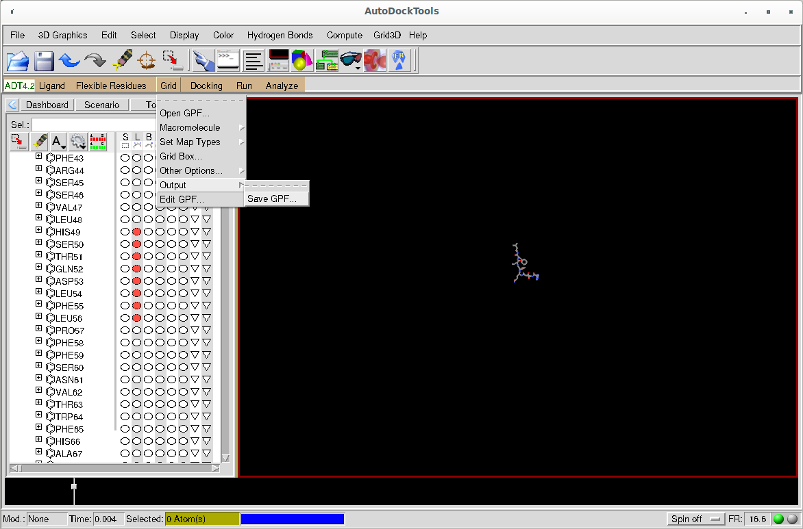

# An HPC conformant Structure Based Screening Workflow

This document descibes a Workflow for screening massive amounts of small molecules (ligands) against a protein target. It is possible to screen millions of ligands and this on multiple targets, if desired. 

Hence, the workflow will require HPC clusters or similar systems. This requires some unorthodox considerations compared to other snakemake workflows, because we need the MPI program [VinaLC](https://github.com/XiaohuaZhangLLNL/VinaLC) and in our setup we make use of special, actually non-mandatory, file systems.

## Optaining the Audodock Tool Suite

In order to prepare the workflow run, users need to define a so-called 'grid file' to describe the region of a protein target of interest (e.g. a receptor binding domain or an allosteric binding domain). 

To prepare the grid file we recommend using the Autodock Tool Suite (ADT), which can be obtained via the [MGLTools download site](https://ccsb.scripps.edu/mgltools/downloads/). Please download a recent version of the tool suite for your operating system, unpack and install according to the instructions.

Then start ADT. Open a [PDBQT file](https://userguide.mdanalysis.org/1.0.0/formats/reference/pdbqt.html#pdbqt-specification) using the 'Grid -> Macromolecule -> Open' menu option. Next, deselect all residues (such that they become invisible). Select those defining your region of interest and invoke the 'Grid -> Grid Box' menue. Define your grid visually such that the displayed box contains your region of interest plus space for putative ligands and save it using the . Be sure that the the resulting gpf file contains the gridcenter and does not state 'auto'.

Note that, the workflow is designed to perform direct docking respectively screening. Here, a putative binding domain should not exceed 9.000 ų as the workflow employs [VinaLC](https://github.com/XiaohuaZhangLLNL/VinaLC), which in turn is based on [Vina](https://vina.scripps.edu/). These programms document this recommandation in [their documentation](https://vina.scripps.edu/manual/). To run 'blind docking' experiments, consult the documentation, too.

## Preparing the Workflow

Expect for the aforementioned gpf file, you will only need to adapt the configuration file of the workflow. 

The first entry is the name of you experiment. Set it, it will be used for data management purposes.

- first you need to adapt the paths. Describe where your in- and output is respectivelly should go to. We also have a `TEMP_DATA_DIR` path. This is only useful, when dealing with a "scratch" file system. If not applicable on your system, just let this path be somewhere in your project directory.
- you may select the percentage of ligands with the highest binding enthalpy to be considered for rescreening (see below) and marked as best hits. All results will be saved, but it is handy for downstream processing to select the best hits, too.
- the `CUTOFF_VALUE` is the upper boundary for resulting binding enthalpies to be considered for selecting ligands subject for re-screening, if any (see below). Note that the unit is in kcal/mol and the value is always negative!
- when defining multiple PDB targets, a first run will be performed using all ligands. Then all further targets will be considered using the high fidelity ligands described above.
- in general you may use ligands defined in the [ZINC](https://zinc.docking.org/) or [Enamine](https://enamine.net/compound-collections/real-compounds/real-database) databases. If you want to use your own ligand database, specify paths in the `LOC_DATA` list. If `["DATASET"]` is given, ZINC or Enamine downloads are considered.
- if working with the ZINC database, make your selection in the next section.
- you may choose a ZINC subset, e.g. `natural-products`, when defining a `SUBSET`. Leave it empty, if working with ZINC tranches defined above.
- alternatively, you may work with the Enamine database. If desired set the `DATABASE` value to 'Enamine'.
- targets and re-screening targets:
  - when `RESCREENING` is false only a screen for the first target will be performed
  - specify your PDB-target(s) under `TARGETS`. Note, that unspecified chains will be ignored. This is useful, if an experimental PDB file contains artifacts, e.g. water molecules or additives, from the crystal, which shall not be considered.
  - note, that the path(!) where you saved your gpf file, should be stored in `GRID_DIR`.
- downloaded ligands are merely text files. To obtain a structure file, we use open babel. Sample energy minimization parameters are given in the configuration file. Adjust, if needed.
- As we are presumably working on an HPC-cluster we need to deviate from ordinary snakemake workflows and spedify so-called module files to obtain or software. You may use conda, too. But for "VinaLC" a module file needs to be given, as conda does not supply MPI bindings.
- the final part is the cluster configuration. These are the resources used on YOUR cluster. Adjust accordingly.